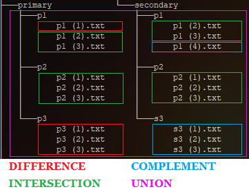
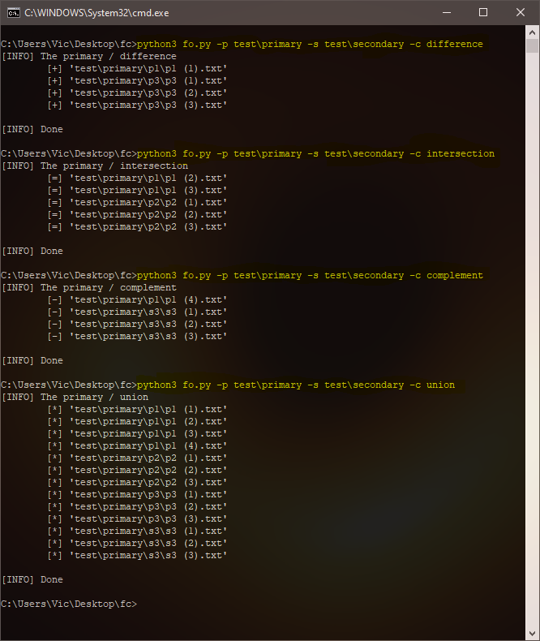
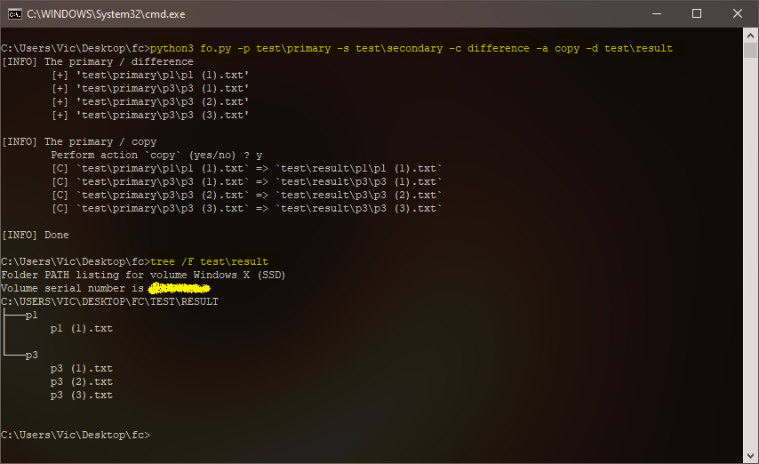
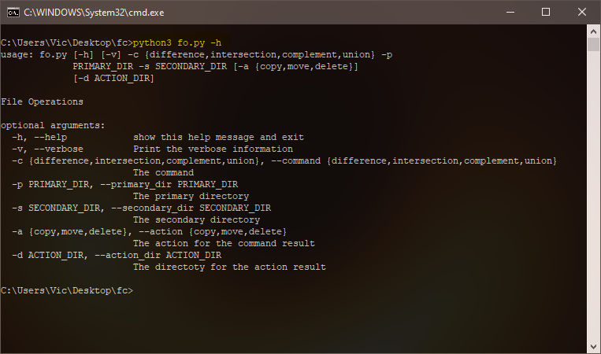

### File Operations CLI ###

#### - Operators {difference,intersection,complement,union}
#### - Actions {copy,move,delete}
_ _ _

##### INSTALLATION #####

> The [PyVutils](https://github.com/vic4key/PyVutils) library can be found on GitHub
>
> To create a single exe (required PyInstaller): PyInstaller --onefile fo.py

##### COMMANDS #####

> $ python3 fo.py -h

##### SCREENSHOTS #####

_ _ _

Website: https://vic.onl/